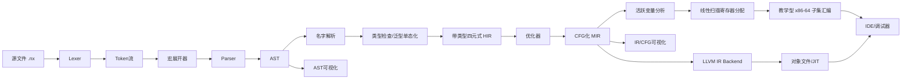

# 高分课程设计编译器项目完整方案（Nexa）

## 执行摘要

本文给出一套面向课程验收与答辩高分的编译器项目实施方案。核心策略是：

- **保底层**：完整覆盖课程基础要求（文法、扫描器、语法分析、符号表、四元式、活动记录、测试验收）。
- **高分层**：增加泛型、宏、并发、可视化 IDE、LLVM 工程后端等展示性能力。
- **工程层**：明确模块接口、测试体系、阶段计划与风险控制，确保可落地交付。

推荐技术路线为：

> 手写 Lexer + 递归下降/Pratt 解析 + 带类型四元式 HIR + SSA-like MIR + 线性扫描寄存器分配 + 教学型 x86-64 子集后端 + llvmlite 工程后端 + PySide6 图形界面

---

## 一、课程适配与总体方案

### 1.1 为什么采用“混合高分型”

相比“纯前端演示”或“全框架黑盒”，混合路线更平衡：

- 前端手写：便于解释算法与答辩追问。
- IR 分层：既满足“四元式”课程要求，又支持后端优化。
- 双轨后端：教学后端可讲原理，LLVM 后端保证稳定产物。
- GUI 可视化：展示 AST/IR/寄存器分配与调试流程，观感加分明显。

### 1.2 推荐架构流程



---

## 二、语言设计（Nexa）

### 2.1 语言定位

- 静态类型、表达式友好、块结构语法。
- 支持函数、结构体、数组/向量、消息通道。
- 高分特性：**泛型、宏、并发**。

### 2.2 核心类型系统

- 基本类型：`i32 i64 f64 bool char str void`
- 复合类型：`Array[T] Vec[T] Option[T] Chan[T] Struct`
- 规则：函数签名显式；局部变量允许受控类型推断。

### 2.3 语法骨架（简化 EBNF）

```ebnf
Program      ::= { Item } EOF
Item         ::= FnDef | StructDef | MacroDef | LetDecl
FnDef        ::= "fn" IDENT GenericParams? "(" ParamList? ")" ReturnType? Block
Block        ::= "{" { Stmt } "}"
Stmt         ::= LetStmt | AssignStmt | IfStmt | WhileStmt | ReturnStmt
               | SpawnStmt | SelectStmt | ExprStmt | Block
Expr         ::= LogicOr
LogicOr      ::= LogicAnd { "||" LogicAnd }
LogicAnd     ::= Equality { "&&" Equality }
Equality     ::= Relational { ("==" | "!=") Relational }
Relational   ::= Additive { ("<" | "<=" | ">" | ">=") Additive }
Additive     ::= Multiplicative { ("+" | "-") Multiplicative }
Multiplicative ::= Unary { ("*" | "/" | "%") Unary }
Unary        ::= ("!" | "-") Unary | Postfix
Postfix      ::= Primary { CallSuffix | IndexSuffix | FieldSuffix }
Primary      ::= IDENT | INT | FLOAT | STRING | "true" | "false" | "(" Expr ")"
```

### 2.4 示例程序（泛型 + 宏 + 并发）

```nexa
macro unless(cond, body) {
    if !cond { body }
}

fn max[T: Ord](a: T, b: T) -> T {
    if a > b { return a; }
    return b;
}

fn main() -> i32 {
    let ch: Chan[i32] = chan(1);
    spawn worker(ch);
    send(ch, 21);

    let ans: i32 = select {
        recv(ch) => { it }
        default  => { 0 }
    };

    unless(ans == 42, { panic("unexpected result"); });
    print(max(ans, 40));
    return 0;
}
```

---

## 三、前端实现（可解释优先）

### 3.1 三阶段分层

1. 词法：源码 → Token 序列。
2. 语法：Token → AST（递归下降 + Pratt）。
3. 语义：AST → 带类型 AST + 符号表 + 诊断。

### 3.2 核心数据结构

- `Token(kind, lexeme, span)`
- `Diagnostic(level, span, message, notes)`
- `ASTNode(kind, children, span, inferred_type)`
- `Symbol(name, category, type_name, scope_id, slot)`
- `HIRInstr(op, dst, src1, src2, ty)`
- `BasicBlock(label, instrs, preds, succs)`

### 3.3 错误恢复策略

- 词法：非法字符/未闭合字符串，跳过至下个合法边界。
- 语法：panic-mode，同步集合 `{ ;, }, ), else, EOF }`。
- 语义：未声明、重复声明、类型不匹配、返回路径缺失。

---

## 四、中间表示与后端

### 4.1 IR 分层

- AST / Typed AST：语法与类型信息。
- HIR：带类型四元式（课程验收关键）。
- MIR：CFG + SSA-like value（用于分析与分配）。
- LIR：寄存器/栈槽绑定后低级 IR。
- LLVM IR：工程后端。

### 4.2 四元式示例

| 编号 | 四元式 |
|---|---|
| 1 | `(mul.i32, 2, 5, t1)` |
| 2 | `(add.i32, t1, a, t2)` |
| 3 | `(mov.i32, t2, _, b)` |
| 4 | `(br.true, cond, _, L1)` |
| 5 | `(jmp, _, _, L2)` |

### 4.3 优化管线（建议）

- HIR：常量折叠、复制传播、DCE、块合并。
- MIR：CFG 简化、不可达删除、局部 CSE、简化 LICM。
- LLVM：交给 `llvmlite` pass manager 做目标相关优化。

### 4.4 寄存器分配

采用**线性扫描**：实现简单、速度快、适合课程规模。

- 输入：live interval
- 输出：虚拟寄存器到物理寄存器/栈槽映射
- 行为：寄存器不足时 spill 到栈帧

### 4.5 活动记录（栈帧）

- 返回地址/旧帧指针
- callee-saved 保存区
- 参数区
- 局部变量区
- 临时值与 spill 区
- outgoing args 区

---

## 五、GUI 与可视化

### 5.1 技术栈

- PySide6：桌面壳层
- Monaco（QWebEngineView）：编辑器
- Graphviz：AST/CFG/IR 导出
- DAP-like 协议：调试面板

### 5.2 UI 布局建议

- 左：工程树
- 中：代码编辑器
- 右：AST/符号表/HIR/CFG 图形区
- 下：编译日志/运行输出/断点与变量

### 5.3 必备交互

- 一键编译并展示 Token/AST/HIR/ASM
- 错误定位与 fix-it 提示
- AST/IR 节点点击回跳源码
- 优化前后 IR 对比
- 断点、单步、变量监视

---

## 六、工程计划与测试

### 6.1 推荐目录结构

```text
nexa/
  frontend/  sema/  ir/  opt/  backend/
  runtime/   ide/   tests/ docs/
```

### 6.2 五层测试体系

1. 单元测试：词法、语法、语义、寄存器分配。
2. 金样测试：Token/AST/HIR/ASM 快照对比。
3. 性质测试：优化前后语义等价。
4. 集成测试：源码到可执行全链路。
5. GUI 测试：面板刷新、错误定位、交互回跳。

### 6.3 风险与缓解

- 需求膨胀 → 第 4 周冻结语法，双层交付。
- 宏系统复杂 → 仅声明式宏 + gensym + 深度限制。
- 并发不稳定 → 默认确定性调度模式。
- RA bug → 先 MiniASM 解释执行自检。
- GUI 阻塞 → 编译异步化，UI 仅消费结果。

---

## 七、PPT 18 页建议结构

1. 封面
2. 项目目标与课程适配
3. 方案比选
4. 总体架构
5. 语言设计总览
6. 文法与样例
7. 类型系统与泛型
8. 宏系统与并发
9. 词法分析
10. 语法/语义与错误恢复
11. 符号表与核心数据结构
12. HIR/MIR 设计
13. 优化与寄存器分配
14. 双轨后端与跨平台
15. IDE 与可视化调试
16. 测试体系
17. 风险、分工、里程碑
18. 演示流程与总结

---

## 八、结论

Nexa 方案的价值在于：

- 对课程要求：**完整覆盖且可验收**。
- 对答辩展示：**特性深度与可视化明显拉开差距**。
- 对工程实施：**路径清晰、范围可控、可分阶段交付**。

一句话总结：

> 这不是“只做前端实验”的课程作业，而是从语言设计到后端与 IDE 的完整编译器工程闭环。
